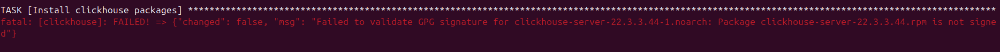
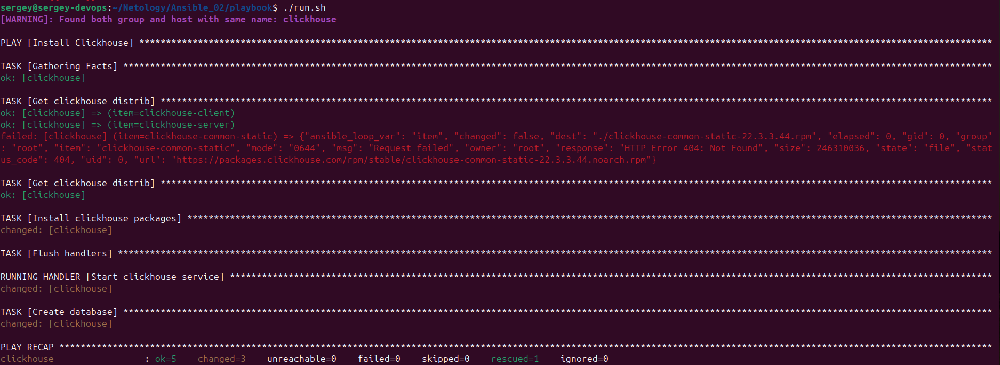
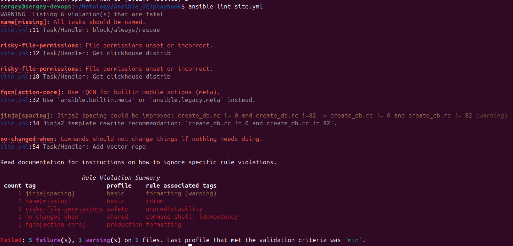
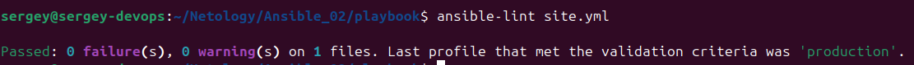
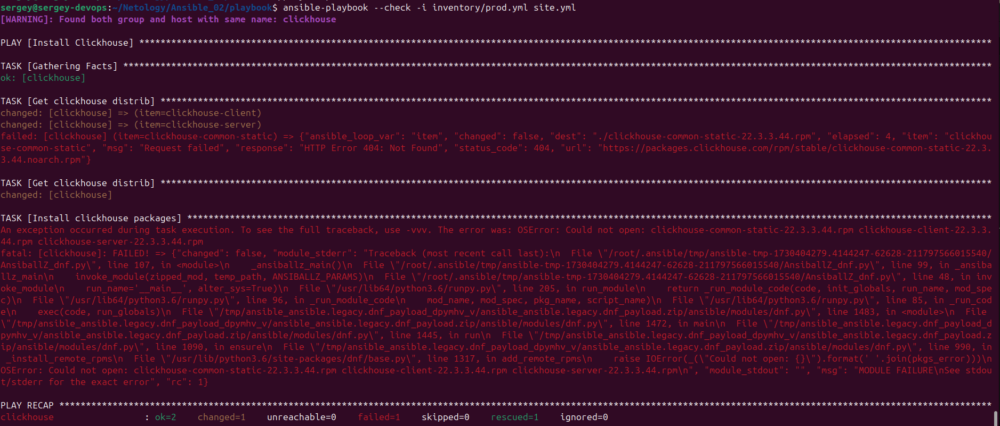
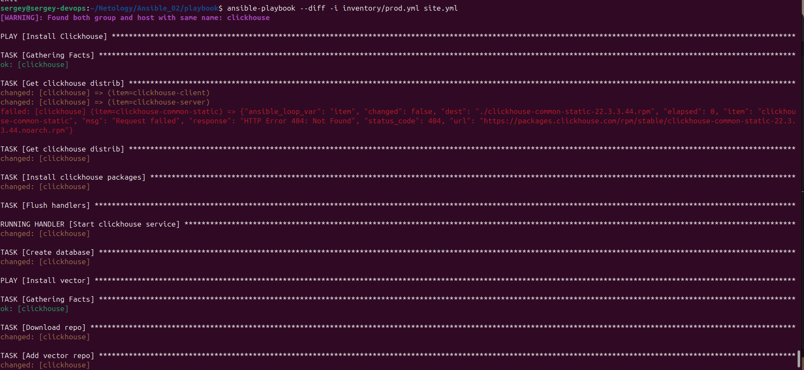
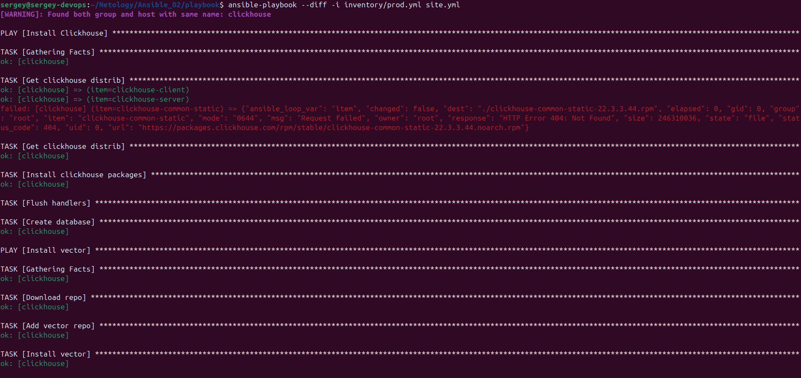

[Задание](https://github.com/netology-code/mnt-homeworks/tree/MNT-video/08-ansible-02-playbook)

#### 1. Подготовьте свой inventory-файл `prod.yml`.
###### Подготовка машин для работы:

- Пишем [`Dockerfile`](prepare_hosts/Dockerfile) и [`compose.yml`](prepare_hosts/compose.yml)

- Запускаем `docker compose -d`

- Пишем [run.sh](playbook/run.sh) для быстрого запуска

- Запускаем, получаем ошибку:  
  

- Добавляем в [`site.yml`](playbook/site.yml) строку:  
`disable_gpg_check: true  

- Запускаем, видим результат:  
  

#### 2. Допишите playbook: нужно сделать ещё один play, который устанавливает и настраивает [vector](https://vector.dev). Конфигурация vector должна деплоиться через template файл jinja2. От вас не требуется использовать все возможности шаблонизатора, просто вставьте стандартный конфиг в template файл. Информация по шаблонам по [ссылке](https://www.dmosk.ru/instruktions.php?object=ansible-nginx-install). не забудьте сделать handler на перезапуск vector в случае изменения конфигурации!
#### 3. При создании tasks рекомендую использовать модули: `get_url`, `template`, `unarchive`, `file`.

- Добавлена часть в [`site.yml`](playbook/site.yml)

- Добавлены 2 шаблона: [`vector.config.j2`](playbook/templates/vector.config.j2) и [`vector.service.j2`](playbook/templates/vector.service.j2)

#### 4. Tasks должны: скачать дистрибутив нужной версии, выполнить распаковку в выбранную директорию, установить vector.

### 5. Запустите `ansible-lint site.yml` и исправьте ошибки, если они есть.

После исправления:

### 6. Попробуйте запустить playbook на этом окружении с флагом `--check`.

На вновь созданном контейнере запуск заврешился с ошибкой, т.к. нет скачанных файлов для запуска

### 7. Запустите playbook на `prod.yml` окружении с флагом `--diff`. Убедитесь, что изменения на системе произведены.

На вновь созданном контейнере, результат:  

### 8. Повторно запустите playbook с флагом `--diff` и убедитесь, что playbook идемпотентен.

Повторный запуск:  

### 9. Подготовьте README.md-файл по своему playbook. В нём должно быть описано: что делает playbook, какие у него есть параметры и теги. Пример качественной документации ansible playbook по [ссылке](https://github.com/opensearch-project/ansible-playbook). Так же приложите скриншоты выполнения заданий №5-8

[README.md](/README.md)

### 10. Готовый playbook выложите в свой репозиторий, поставьте тег `08-ansible-02-playbook` на фиксирующий коммит, в ответ предоставьте ссылку на него.
